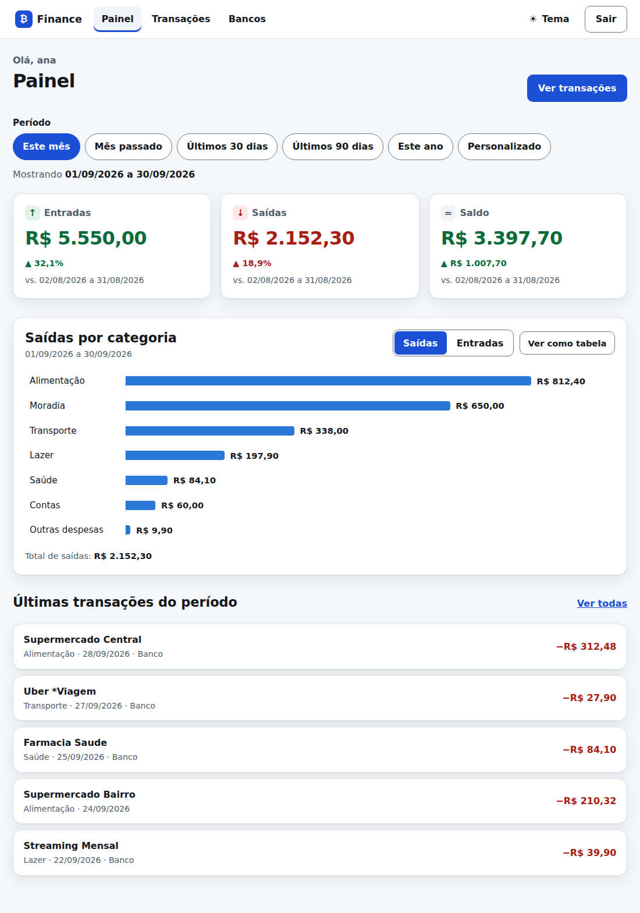
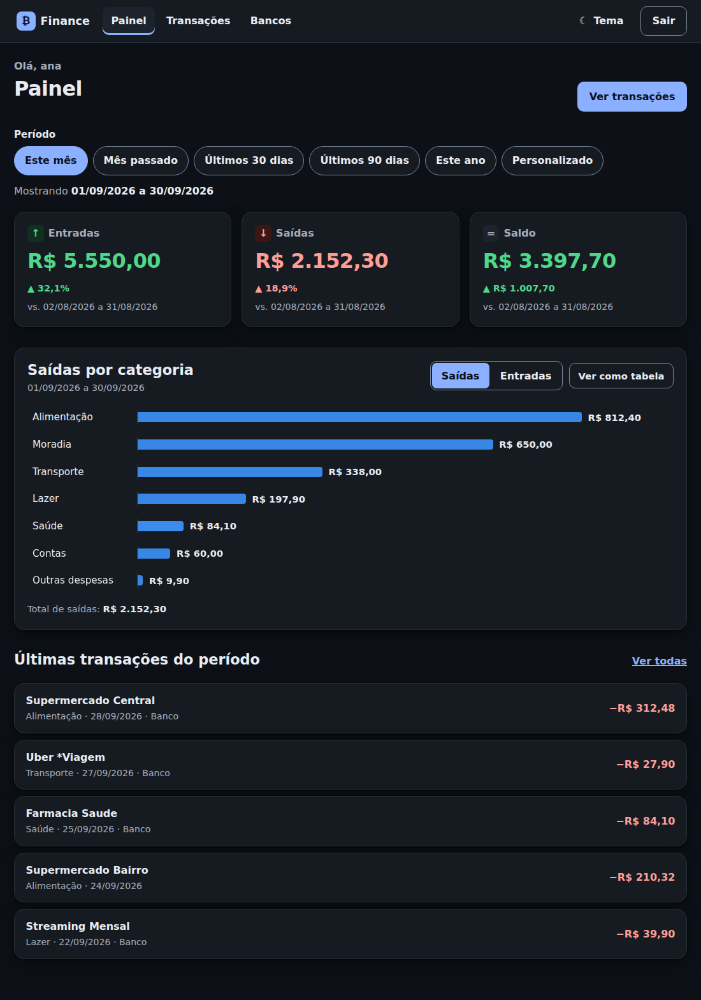
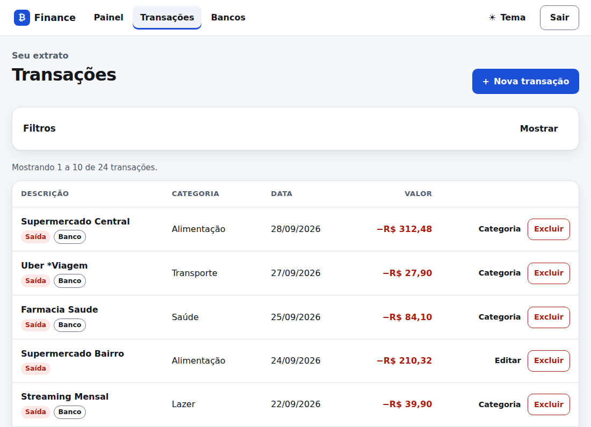
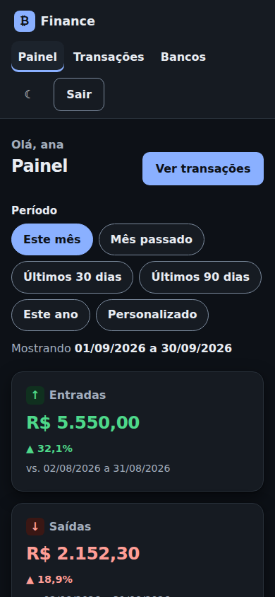
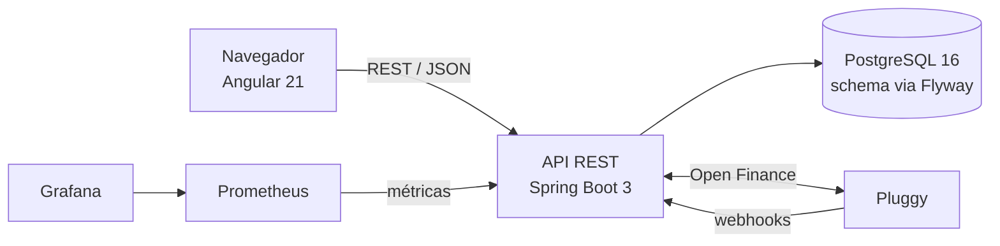

# Finance API

**Controle financeiro pessoal com Open Finance.** API REST em Java 21 e Spring Boot, front Angular acessível, PostgreSQL e observabilidade. O backend sobe com um `docker compose up` e o front com `npm start`.

[](https://github.com/caioeduardopereirafelix/finance-api/actions/workflows/ci.yml)


<p>
  
  
</p>
<table>
  <tr>
    <td valign="top" width="68%"></td>
    <td valign="top" width="32%"></td>
  </tr>
</table>

## O que faz

Cada pessoa se cadastra, conecta seus bancos pelo **Open Finance** (Pluggy) e vê o dinheiro num painel: entradas, saídas e saldo por período, comparados com o período anterior, e um gráfico por categoria. As transações do banco entram sozinhas e sem duplicar, já categorizadas; o que a pessoa corrige vira regra e vale para as próximas importações.

## Números

| Indicador | Resultado |
|---|---|
| **Testes** | mais de 200 no backend (com a cadeia real do Spring Security e PostgreSQL de verdade) e 86 no front |
| **CI** | GitHub Actions: build e testes do backend, testes e build de produção do front |
| **Desempenho** | ~1.400 escritas/s e ~900 consultas de período/s; p99 abaixo de 45 ms (16 conexões, 100 mil transações do usuário, máquina de 4 vCPUs dividida com o banco) |
| **Migrations** | 10, com um teste que impede editar uma já aplicada |
| **Acessibilidade** | WCAG 2.2 AA, auditado com axe-core (0 violações nas telas verificadas), tema claro e escuro, funciona a 320 px |
| **Front** | 81 kB transferidos na carga inicial; cada tela carrega sob demanda |

## Desempenho

Medido com 1,05 milhão de transações na tabela e 100 mil do usuário testado, PostgreSQL 16 padrão e a API com heap de 512 MB. Zero erros.

| Operação | p50 | p99 | req/s (16 conexões) |
|---|---:|---:|---:|
| Criar transação | 3,8 ms | 7,7 ms | ~1.400 |
| Resumo do mês | 6,2 ms | 10,7 ms | ~890 |
| Listar com filtro de período | 6,2 ms | 11,6 ms | ~990 |
| Listar transações (página 1) | 21,9 ms | 34,7 ms | ~185 |
| Resumo de tudo (100 mil linhas) | 36,5 ms | 64,4 ms | ~97 |

p50 e p99 com uma conexão (latência sem fila). A primeira página da listagem lê os dados em **0,07 ms** pelo índice `(user_id, occurred_at DESC)`; o que pesa é a contagem total da paginação. O login leva ~85 ms de propósito (bcrypt).

## Arquitetura



Em camadas dentro da API: controllers, services, repositories, DTOs, mappers e tratamento centralizado de erros.

## Decisões que valem olhar

**Segurança**
- **Isolamento por usuário:** cada pessoa só enxerga e altera o que é dela. Um id de outro usuário responde `403`, igual a um id inexistente, então não dá para descobrir quais existem.
- **Refresh token** opaco, guardado só como hash SHA-256, de uso único com rotação; o logout revoga.
- **Trava de login:** 5 senhas erradas seguidas bloqueiam o e-mail por 15 minutos (`429` com `Retry-After`).
- **E-mail normalizado** (minúsculas, sem espaços) em cadastro, login e recuperação de senha, então `Caio@Gmail.com` e `caio@gmail.com` são a mesma conta; o cadastro exige domínio com TLD.
- **Trocar a senha** pela API exige a senha atual, derruba os refresh tokens e avisa por e-mail.
- **Confirmação de e-mail** no cadastro: quem ainda não confirmou entra e usa o painel, mas não conecta banco (`403`); o link é de uso único, vale 24 horas, o reenvio tem intervalo mínimo (`429` com `Retry-After`) e trocar o e-mail desfaz a confirmação. Quem já tinha conta antes da migration conta como confirmado.
- **Recuperação de senha** por link de uso único: token de 256 bits guardado só como hash, validade de 30 minutos, enviado no fragmento da URL (não vai para logs nem para o `Referer`); a resposta é a mesma para e-mail cadastrado ou não, o pedido tem intervalo mínimo por conta e a troca revoga os refresh tokens e destrava o login.
- **Webhook público** protegido por segredo no caminho, com comparação em tempo constante; o dono de cada conexão bancária é conferido pelo `clientUserId`.
- **Apagar a conta** revoga as conexões bancárias na Pluggy antes.
- A aplicação **não sobe sem `JWT_SECRET`** de pelo menos 32 bytes; o actuator roda em porta separada; a imagem da API não roda como root.

**Dados**
- **Flyway** é o dono do schema (`ddl-auto: validate`) e `MigrationImmutabilityTest` falha o build se uma migration já aplicada for alterada.
- **Importação idempotente:** índice único parcial `(usuário, id externo)`; sincronizar três vezes não duplica (verificado contra PostgreSQL).
- **Datas e fuso:** o período é calculado em `America/Sao_Paulo` com limite superior exclusivo; uma compra às 23:30 cai no dia certo.
- **Somas no banco:** `SUM`/`GROUP BY` no PostgreSQL em vez de carregar as transações na memória: 70 a 100 ms contra 420 a 520 ms só para trazer as 100 mil linhas.

**Produto e engenharia**
- **Categorização que aprende:** escolher a categoria de uma compra do banco vale para as parecidas (mesmo estabelecimento) e para as próximas importações, por usuário.
- **Gráfico acessível:** cor única, tabela equivalente ("Ver como tabela") e dica de valores por foco de teclado, não só por mouse.
- **Testes isolados do `.env`:** a suíte não muda de resultado com as suas credenciais, e há um teste que garante isso.
- **Docker:** build em dois estágios, healthcheck da API, Prometheus e Grafana com versão fixa e uma sobreposição de produção que não expõe o banco nem o monitoramento.

## Stack

| Camada | Tecnologias |
|---|---|
| Backend | Java 21, Spring Boot 3.3 (Web, Data JPA, Security, Validation), JWT, Hibernate, Flyway, MapStruct, Lombok |
| Front | Angular 21 (componentes standalone, signals), sem biblioteca de UI ou de gráficos |
| Dados | PostgreSQL 16 |
| Integração | Pluggy (Open Finance): widget, sincronização, webhooks, reautorização |
| Operação | Docker Compose, Prometheus, Grafana, GitHub Actions |
| Testes | JUnit 5, Mockito, Spring Security Test, Testcontainers, Vitest |

## Rodando

Crie um `.env` na raiz com três valores: `JWT_SECRET` (gere com `openssl rand -base64 48`), `POSTGRES_PASSWORD` e `GRAFANA_PASSWORD`. Depois:

```bash
git clone https://github.com/caioeduardopereirafelix/finance-api
cd finance-api
docker compose up -d --build
```

Isso sobe a API, o PostgreSQL, o Prometheus e o Grafana. O front roda à parte, com Node 22:

```bash
cd frontend
npm install
npm start
```

| Serviço | Endereço |
|---|---|
| Front | http://localhost:4200 |
| Swagger | http://localhost:8080/swagger-ui.html |
| Grafana | http://localhost:3000 |

O front fala com a API pelo proxy do servidor de desenvolvimento (`frontend/proxy.conf.json`), então não precisa configurar CORS.

Recuperação de senha e confirmação de e-mail: por padrão nenhum e-mail sai de verdade e o link aparece no log da API (`docker compose logs api`). Para enviar por SMTP (por exemplo, o Brevo: `smtp-relay.brevo.com`, porta `587`), acrescente ao `.env` `MAIL_TRANSPORT=smtp`, `MAIL_HOST`, `MAIL_PORT`, `MAIL_USERNAME`, `MAIL_PASSWORD`, `MAIL_FROM` e `FRONTEND_URL` (o endereço público do front, usado no link).

Para testar a parte bancária sem credenciais da Pluggy, acrescente `BANK_MOCK_ENABLED=true` e `BANK_PROVIDER=mock` ao `.env`: um banco de demonstração importa sete transações.
## API

| Área | Endpoints |
|---|---|
| Autenticação | `POST /v1/auth/register`, `/login`, `/refresh`, `/logout`, `/forgot-password`, `/reset-password`, `/verify-email` |
| Transações | `POST`, `GET`, `PUT`, `DELETE /transaction`, `PATCH /transaction/{id}/category` |
| Conta | `GET /account`, `POST /account/email-verification` (reenviar confirmação) |
| Resumos | `GET /transaction/summary`, `GET /transaction/summary/by-category` |
| Bancos | `/bank/connections` (conectar, listar, sincronizar, reautorizar, desconectar) |

## Autor

**Caio Eduardo** · [github.com/caioeduardopereirafelix](https://github.com/caioeduardopereirafelix) · Licença [MIT](LICENSE)
